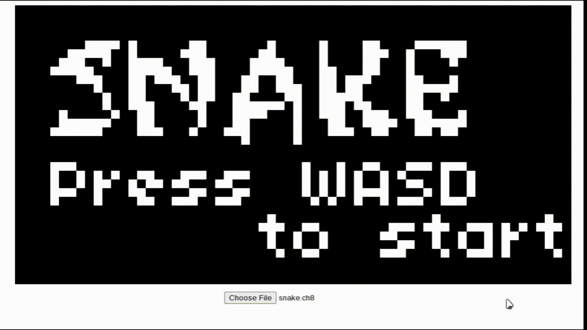

## Chip-8 
### A Basic [Chip-8](https://en.wikipedia.org/wiki/CHIP-8) emulator written in rust




## Summary 
- [How to use](#how-to-use)
- [Building the Project](#building-the-project)
- [Credits](#credits)
- [License](#license)


## How to use :zap:

#### Web
Access the [web version]() to run Chip-8 programs directly in your browser.

#### Linux Binary

Download the binary [here](https://github.com/CarlosDanielMaturano/chip8/archive/refs/tags/v1.0.zip).

After downloading, navigate to the directory containing the binary in your terminal.

Run the emulator with the following command:
```bash
./chip8 <path-to-the-rom>
```

## Building the Project :hammer:

### Dependencies:

Make sure you have the following dependencies installed on your machine:

- SDL2
- wasm-pack 

You can install wasm-pack using Cargo:
```bash
cargo install wasm-pack
```

### Building the SDL2 Version

Navigate to the root directory of the project.
Run the following command:
```bash
cargo build  
```
The binary will be produced in the /target/debug/ directory with the name chip8.

### Building the Web Version

Open the webasm directory in your terminal.
Run the following command:
```bash
wasm-pack build --target web
```

This will generate a pkg directory containing the necessary WebAssembly code.
To access the web version, you need to set up a local server.
Run the following command in the webasm directory:

```bash
python3 -m http.server
```

Open your browser and navigate to the local server address
to access the web version of the emulator.

### Using the Makefile

If you have make installed, you can use the Makefile to simplify the build process,
on the root directory, run one of the following commands:

```bash
make sdl2
```
This will generate an out directory containing the binary 

```bash
make webasm
```
This will generate an www directory with the web version.


### Credits :sparkles:

- ROMs for testing obtained from the Git repository:
[chip8-test-suite](https://github.com/Timendus/chip8-test-suite.git)

- Book about Chip-8 Emulation using Rust:  
[chip8-book](https://github.com/aquova/chip8-book)

- Rom running on the gif:
[rom](https://johnearnest.github.io/chip8Archive/play.html?p=snake)

### License :balance_scale:
The project is under the [MIT](./LICENSE) License
